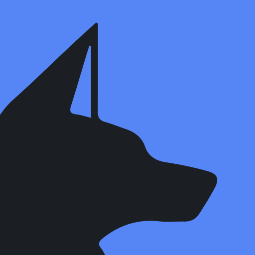

  

Anubis is a distributed LMS (learning management system) created by [John Cunniff](https://github.com/wabscale) that 
is specifically designed for automating CS courses. Anubis has been used and battle tested at [NYU Tandon](https://engineering.nyu.edu/)
for several semesters. The main purposes of this system is to autograde homework submissions, and provide our own Cloud IDE solution to 
simplify the student experience.

> _Anubis is built by CS students for CS students_

# Anubis Projects

# Other Projects We Maintain

